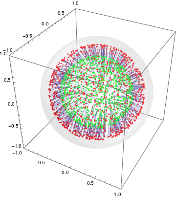

This is my license thesis' repository

TO DO LIST
 1. Find extended unitary
 2. Try other observables to contruct the MaxEnt
 3. Coordinate histograms for the AssMap under swap
 4. Thesis' intro
 5. Develop $$U\otimes V$$ using exponential of pauli vector
 6. Exploring general $$U$$ as $$U=\sum_{ij}\alpha_{ij} U_{i}\otimes V_{j}$$
 7. Read Jaynes' articles
 8. Series of real exponential of a pauli vector: pauli coordinates in terms of lagrange mult.